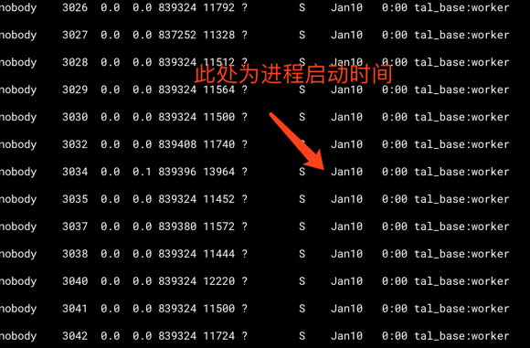

# 服务启动及管理

注意：如果项目没有引入Symfony Console 那么命令php /bin/fend是无法执行的，请替换成/Bin/start.php

### 服务启动

```bash
php /bin/fend Swoole -c app/Config/Swoole.php start
//或
php /bin/start.php -c app/Config/Swoole.php start
```

启动服务

此时可以请求 curl 127.0.0.1:9572/path1/path2 即可请求到application/path1/path2.php内index函数

如/conf/swoole.php内没有开启daemon=1那么当前命令行会阻塞运行，要退出当前服务可以使用ctrl+c即可退出

服务启动期间已加载内容不会随着磁盘代码更新而刷新

### 服务平滑重启

```bash
php /bin/fend Swoole -c app/Config/Swoole.php restart
//或
php /bin/start.php -c app/Config/Swoole.php restart
```

对于线上已经开启daemon的服务使用上面命令重启swoole服务即可，注意极个别情况下，业务代码有问题会导致重启失败。

失败现象

```bash
ps aux|grep tal_fend
```

重启 后通过以上命令发现极个别worker的启动时间仍旧没有刷新



注意：建议开发使用重启功能，及个别情况下会导致残余

### 强杀服务

```bash
php /bin/fend Swoole -c app/Config/Swoole.php kill 
//或
php /bin/start.php -c app/Config/Swoole.php kill
```

会遍历当前服务内所有tal\_fend服务进程pid执行kill -9

### 服务停止

```bash
php /bin/fend Swoole -c app/Config/Swoole.php stop 
//或
php /bin/start.php -c app/Config/Swoole.php stop
```

### 其他注意事项

命令行启动重启是依靠app/Config/Swoole.php内pid\_file配置获取到当前服务的master进程号，并对其发送信号实现的（除强杀功能）

如果此文件不可访问，那么会导致restart及stop工作异常，此时可以手动操作对进程进行操作

```bash
ps aux|grep tal_fend|grep master #查找对应master进程pid
kill master进程pid  #切记请勿轻易使用 kill -9
```

### 开发模式
使用如下命令启动，命令行会阻塞，服务只会启动一个worker，请求两次会重启worker，这样业务代码会定期刷新方便调试开发
```bash
php /bin/fend Swoole -c app/Config/Swoole.php -d 1 start
//或
php /bin/start.php -c app/Config/Swoole.php start -d
```