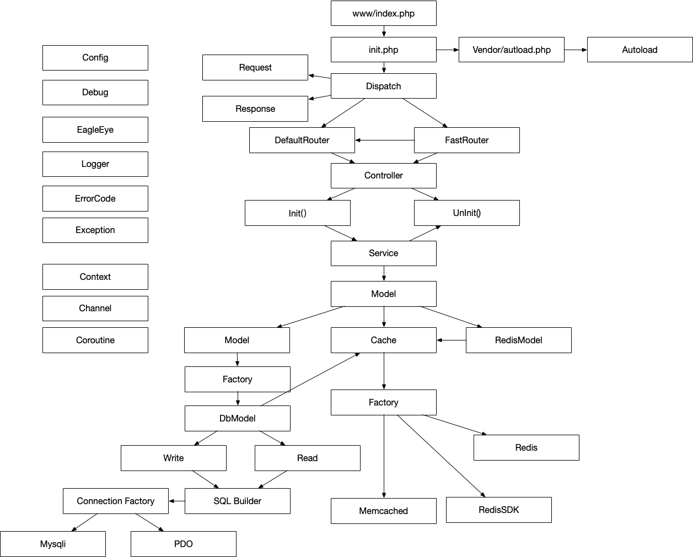
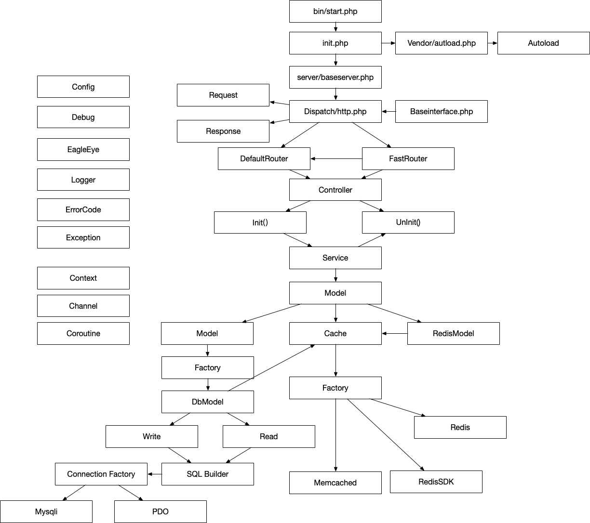

# 框架启动顺序 
由于Fend框架有两个工作模式，框架初始化部分略有不同，具体如下：

## PHP-FPM启动加载顺序

1. **/www/index.php** \#所有nginx请求都会rewrite到此文件，如果nginx指定目录存在对应物理文件不会rewrite
2. **/init.php** \#加载框架初始化变量定义，如框架根目录路径
3. **/vendor/autoload.php** \#composer autoload 
4. **/fend/Config** \#按需加载Config
5. **/app/Config/\*.php** \#常量定义及其他配置加载内含Db.php Redis.php
7. **/fend/Router.php** \#实际请求router所在地，router到对应controller并调用此函数，如果没有指定函数默认调用controller-&gt;index\(\)
   1. ob\_start\(\); 
   2. Init()
   3. FastRouter 查找
   4. Direct Router 查找
   3. new Controller\_xxxx-&gt;methodxxxx\(\)
   4. Uninit()
   5. ob\_end\(\);
8. Debug界面
9. FPM 结束

## Swoole服务容器加载顺序

1. /bin/fend swoole start -c app/Config/Swoole.php#服务启动
2. /init.php
3. /vendor/autoload.php #autoload 加载
5. /fend/Server/Baseserver.php #根据Config组装swoole服务监听配置指定端口，并启动
6. /fend/Dispatcher/Baseinterface.php #swoole基础事件接口定义类
7. /fend/Dispatcher/Http.php #捆绑指定端口的http事件到当前类
8. /fend/Router.php #根据路由规则加载指定Controller
9. ob_start();
10. FastRouter（可选） 查找匹配规则controller
11. Direct Router 查找 controller文件
12. new Controller_xxxx
13. ->Init()
14. ->methodxxxx()
15. ->Uninit()
16. ob_end();
17. clean var #服务并没有退出继续服务其他请求
