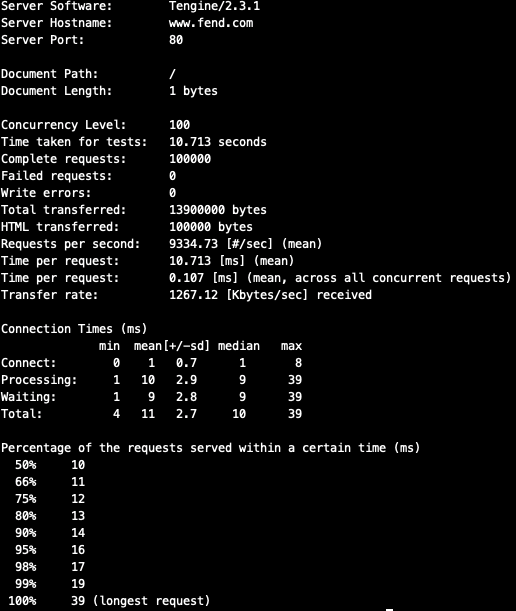
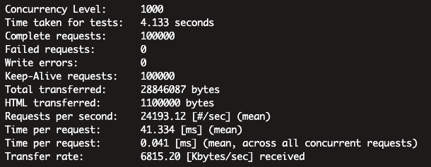
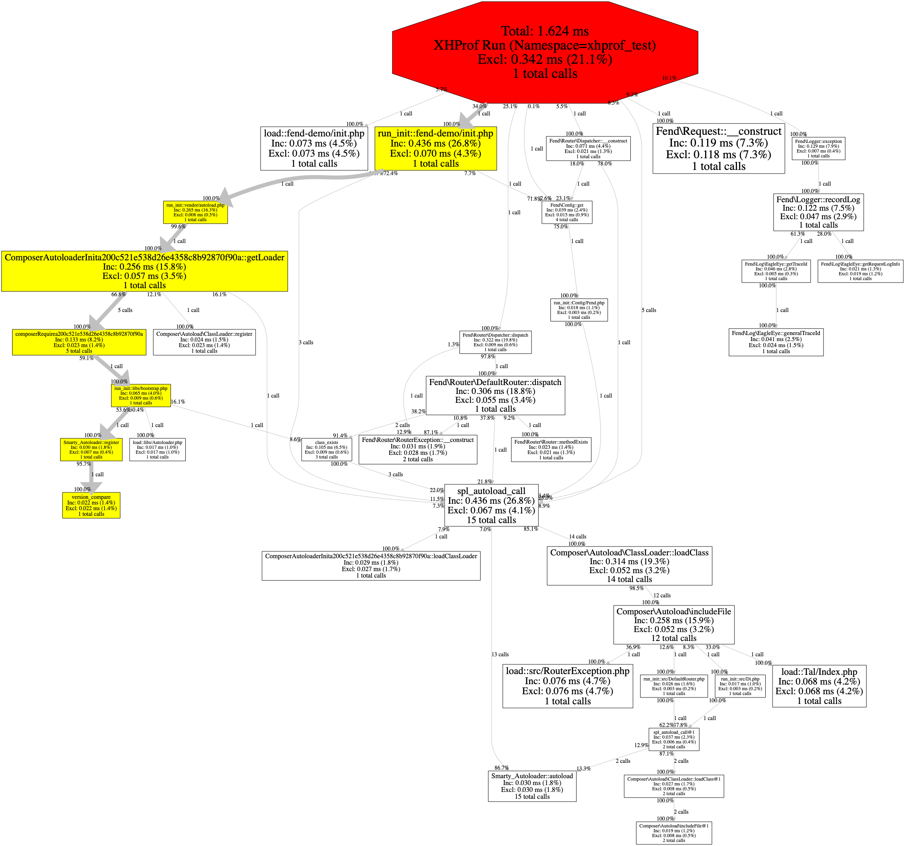
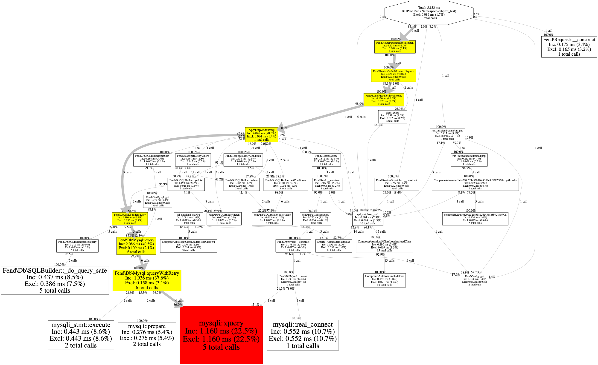
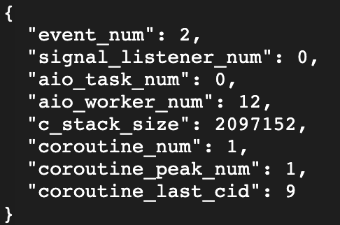

# 性能优化

## Composer
php的psr4标准会根据类名及namespace搜索类所在位置，但是会导致多次调用file_exist导致服务性能下降，线上项目可以执行以下命令进行优化
```bash
bin\optimizeComposer.sh
```
实际内部命令如下 
 
原理：将目前项目内所有文件进行扫描，将类名和文件名记录在一个数组内，通过数组来确认文件是否存在，减少磁盘请求次数 
 
缺点：对文件增删不敏感，会导致新类无法被检索到 

```bash
composer dump-autoload -o -a --no-dev
```

注意：如果composer在saltstack下执行时有错误提示The HOME or COMPOSER_HOME environment variable must be set for composer to run，那么需要设置环境变量HOME
```bash
cd /home/www/xxx.xxx.com/ &&  HOME="/home/www" COMPOSER_HOME="/home/www/.config/composer" /usr/local/php7/bin/php ./bin/composer dump-autoload -o -a --no-dev
``` 

composer有一些依赖只是在开发环境需要，运行服务时无需加载，可以使用如下命令卸载掉无用组件
```bash
composer install --no-dev
```

清理composer内无用组件可以提高FPM模式下服务接口响应速度，如：不使用symfony console以及fast-router, 可修改composer.json内require，去掉"nikic/fast-route"，及"symfony/console"
```json
[
 "require": {
        "nikic/fast-route": "^1.3", //可删除
        "symfony/console": "^4.3", //可删除
        "smarty/smarty": "^3.1" //可删除
    }
]
```

## 关闭链路跟踪及日志
目前框架自带链路跟踪，但是同时会有一定性能损耗，如果无需此功能可以关闭 

 > 配置文件在：app\Config\Fend.php 内 

```php
return [
    "log" => [
        "trace" => true, //是否开启trace日志
        "level" => \Fend\Logger::LOG_TYPE_INFO,     //分级日志记录级别，如果不想记录设置为LOG_TYPE_NONE
        "path"  => SYS_ROOTDIR . 'logs' . FD_DS,    //日志记录绝对路径 \Logs\eagleeye\*.log
        "filenameWithPid" => true,                  //日志文件增加getmypid，线上建议开启，主要原因是多进程高并发写大于8k的日志会导致文件内容相互覆盖
        "logFormat" => "json",                      //日志输出格式 json: json_encode方式, export:var_dump常见标准日志
        "logRoll" => "day",                         //日志滚动规则 none:不滚动，day:按天滚动，hour:按小时滚动
    ],

    "debug" => true,        //是否开启debug模式，如果开启在网址增加query参数?wxdebug=1可以看到错误原因

];

```

## 压测性能
服务器环境
 * 虚拟服务器
 * 4核 12G内存
 * CentOS 7.6.1810 
 * PHP 7.1.5 
 * Swoole 4.4.7
 * Apache Bench

### KVM PHP-FPM 模式下
测试细节
 * 开启fpm worker 1400
 * 关闭trace日志
 * Controller直接返回 return 1;
 * composer dump-autoload -o -a --no-dev
 * ab -c 100 -n 100000 http://www.fend.com/
 


空跑FPM 12000 QPS 
带框架跑 9334 QPS 平均响应 10~19 ms

### KVM 线上FPM模式业务测试
 * 4核 12G内存 三台虚拟机 
 * 业务操作三次redis 压12000 QPS 每台4000 QPS
 * 空跑框架是18000 QPS 每台6000 QPS

### KVM Swoole 阻塞模式下(非协程)
测试细节
 * 开启worker 20个
 * 关闭trace日志
 * Controller直接返回 return 1;
 * composer dump-autoload -o -a --no-dev
 * ab -c 100 -n 100000 http://www.fend.com:9572/
 


带框架跑 19375 QPS 平均响应 5~8 ms

### Xhprof性能取样

#### 空跑
测试细节
 * 开启php-fpm 20个
 * macbook pro 2019 15.4 cpu:i7 mem:16G 本机测试
 * Controller直接返回 return microtime(true);
 * composer dump-autoload -o -a --no-dev
 * ab -k -c 100 -n 8000  "http://www.fend1.com/"
 
采样一次分析框架耗时情况



##### Mysqli
测试细节
 * 开启php-fpm 20个
 * macbook pro 2019 Size:15.4 CPU:i7 2.6G Mem:16G 本机测试
 * Xphrof 请求 Controller 查询5次SQL
 * composer dump-autoload -o -a --no-dev
 * ab -k -c 100 -n 8000  "http://www.fend1.com/index/sql" 
 
采样一次分析框架耗时情况


## 协程性能排查
性能低下排查、在App\Index\Index.php内添加
```php
public function status(Request $request, Response $response)
{
   return  $response->json(\Swoole\Coroutine::stats());
}
```

通过这段代码能够查看swoole协程运行情况，具体如下图 

 

如果接口中含有阻塞服务，会导致协程无法切换，压测此接口返回数据coroutine_peak_num会永远是一个很小的数（比如1），此数代表最高并发协程数，如果用户在接口中自行开启协程那么此数字不确定 

目前已知memcached驱动不支持协程 