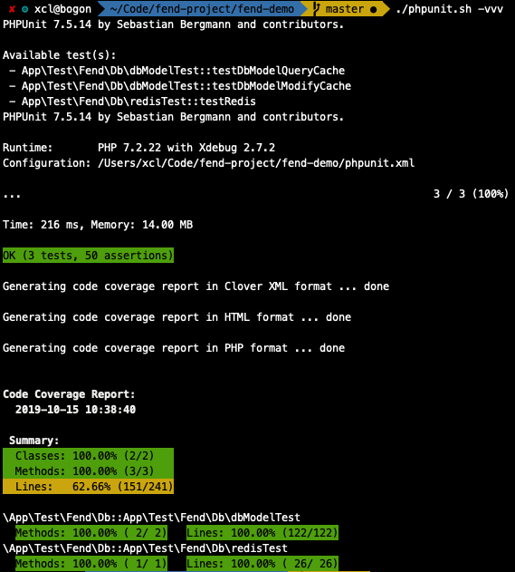
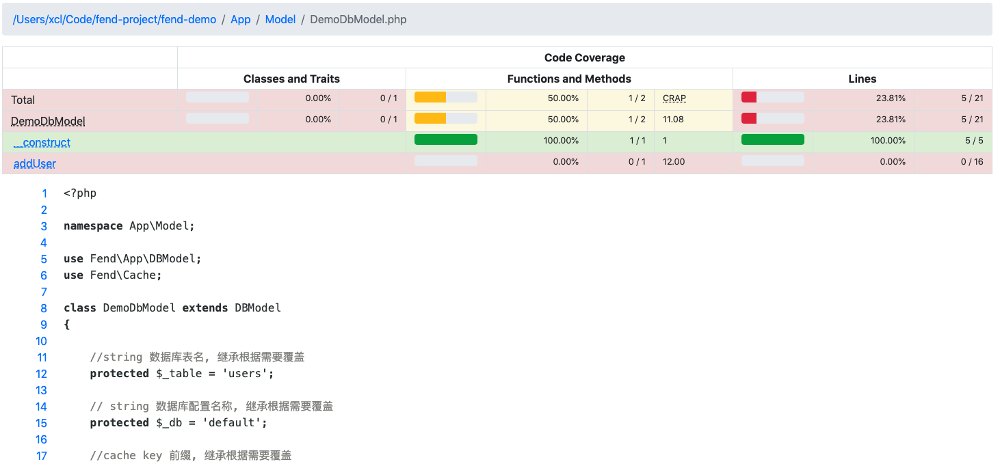
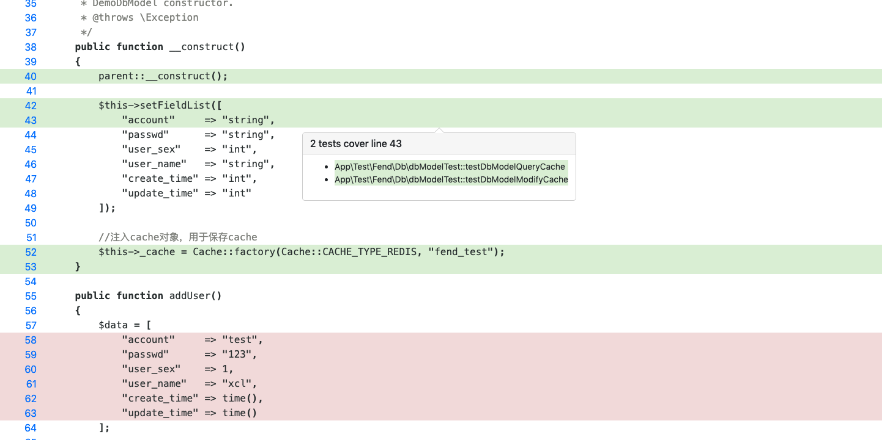
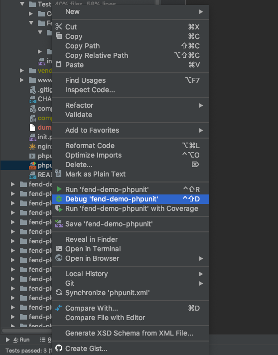
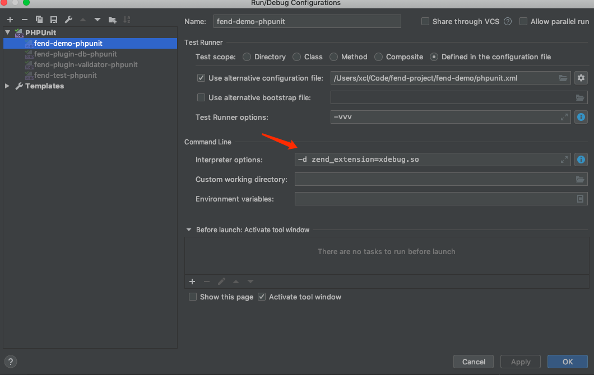
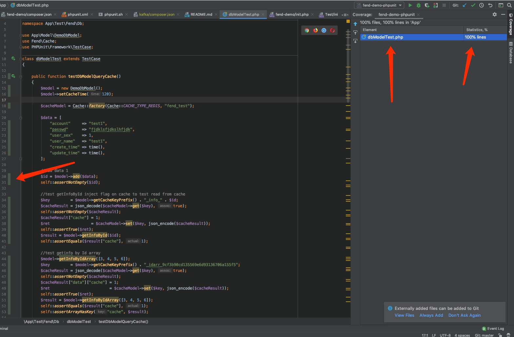

# 单元测试
Fend组件基本都实现了单元测试，通过单元测试能够保证在版本迭代中持续的修改都是向下兼容的 

Fend开发组会持续提高各个组件的单元测试覆盖率，以此保证代码接口及质量的稳定。

## 框架组件单元测试
Fend基本每个组件根目录下都会提供一个phpunit.xml 以及phpunit.sh

phpunit.xml内规定: 

 * 每次测试之前会加载tests/init.php
 * init.php内会初始化框架，指定配置路径（如test\Config下）
 * 测试脚本所在目录（tests 下 Test.php结尾的文件 && Test结尾的函数）
 * 指定测试报告检测覆盖白名单（src、app、tests目录）
 * 指定生成报告在coverage目录下

环境准备: 

```bash
# 初始化composer及安装phpunit相关composer
composer install 

# 请确认安装了php xdebug扩展
# 下面的脚本会执行单元测试，脚本内指定了临时加载xdebug.so
# 建议用户安装xdebug.so后不在php.ini内标注extension=xdebug.so （预防xdebug和swoole冲突）
./phpunit.sh
```
 

上图为脚本执行成功效果

成功后会在coverage目录下生成report文件夹，访问内部index.html即可查看代码单元覆盖率 

注意：如测试过程中产生错误或没有安装xdebug扩展是无法看到此目录

### 单元测试 整体覆盖率
 

### 单元测试 代码覆盖率

 

### 单元测试 代码行覆盖情况及调用测试样例
 

## 业务代码接入单元测试

业务可以参考项目 fend 提供了业务单元测试样例

phpunit.xml内
```xml
<?xml version="1.0" encoding="UTF-8"?>
<phpunit backupGlobals="false"
         backupStaticAttributes="false"
         colors="true"
         convertErrorsToExceptions="true"
         convertNoticesToExceptions="true"
         convertWarningsToExceptions="true"
         processIsolation="false"
         stopOnFailure="false"
         bootstrap="./tests/init.php">
    <testsuites>
        <testsuite name="all">
            <directory suffix="Test.php">./tests</directory>
            <exclude>App/Exec</exclude>
        </testsuite>
    </testsuites>
    <filter>
        <whitelist processUncoveredFilesFromWhitelist="true">
            <directory suffix=".php">tests</directory>
            <directory suffix=".php">app</directory>
            <exclude>
                <directory suffix=".php">app/Exec</directory>
            </exclude>
        </whitelist>
    </filter>
    <logging>
        <log type="coverage-html" target="coverage/report" lowUpperBound="35" highLowerBound="70"/>
        <log type="coverage-clover" target="coverage/coverage.xml"/>
        <log type="coverage-php" target="coverage/coverage.serialized"/>
        <log type="coverage-text" target="php://stdout" showUncoveredFiles="false"/>
        <log type="testdox-html" target="coverage/testdox.html"/>
        <log type="testdox-text" target="coverage/testdox.txt"/>
    </logging>
</phpunit>
```

composer.json
composer json 内需要集成phpunit组件
```json
{
    "require-dev": {
        "phpunit/phpunit": "^7.5.14"
    }
}
```
phpunit.sh
```bash
# 列出当前项目所有可测试单元样例列表
php bin/phpunit --list-tests

# 启动单元测试，并且临时加载xdebug扩展，输出报告会根据phpunit.xml配置工作
php -d zend_extension=xdebug.so bin/phpunit -vvv
```

## 如何在phpstorm下配置单元测试

右键点击phpunit.xml 选择Run phpunit.xml with Coverage



会执行一次，然后选择运行配置进行修改


修改成如下配置



选中这个执行配置，点执行即可看到Coverage面板展示结果，同时代码左边会出现绿色条代表被覆盖，红色代表没有覆盖



## 测试替身 Mock
更多详细介绍：https://phpunit.readthedocs.io/zh_CN/latest/test-doubles.html 

此章节由包一磊老师奉献 

如果我们的服务都在DI内注册、那么可以很方便的用Mock类替换掉之前类减少测试环境的数据依赖，降低测试成本

PHPUnit Stub可以模拟类，并可设置模拟返回指定内容，用于多团队并行开发使用本地联调使用，如：
```php
// 创建 SomeClass 类建立桩件。
$stub = $this->getMockBuilder(SomeClass::class)
             ->disableOriginalConstructor()
             ->disableOriginalClone()
             ->disableArgumentCloning()
             ->disallowMockingUnknownTypes()
             ->getMock();

// 配置桩件。
$stub->method('doSomething')
     ->willReturn('foo');

// 现在调用 $stub->doSomething() 将返回 'foo'。
$this->assertEquals('foo', $stub->doSomething());
```